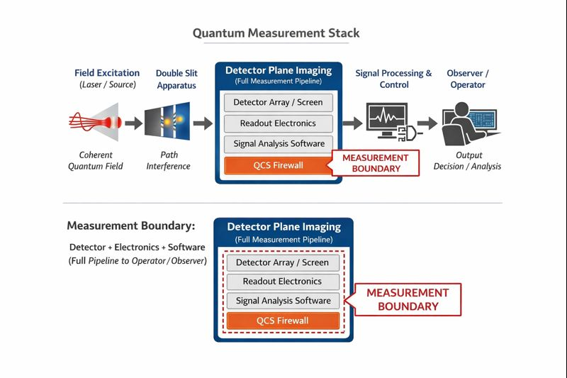

# Quantum Measurement Stack

[]

**Authoritative QMCTB-01 v1.0 archive:**  
https://doi.org/10.5281/zenodo.18075090

The **Quantum Measurement Stack (QMS)** is an instrumentation-focused framework
that treats quantum measurement as a causally ordered pipeline, rather than a
single abstract event.

The framework operationally localizes irreversible information loss at the **detector plane**,
defined as the complete detector–electronics–software measurement pipeline.

---

## Protocol Status: QMCTB v1.0 (Frozen)

The **QMCTB v1.0 detector-plane causality benchmark** is **frozen**.

This means:
- The measurement boundary definition is fixed
- The causal decomposition is fixed
- Benchmark logic, pass/fail criteria, and interpretation rules are fixed
- No parameter, algorithmic, or structural changes are permitted within v1.0

The frozen protocol specification and custodial scope are defined in:

📄 **`QMCTB-01_v1.0_Freeze_and_Custody.md`**

Future extensions or alternative benchmarks will be released only under new
version identifiers and will not retroactively modify QMCTB v1.0.

---

## Canonical Measurement Stack

**Measurement boundary (non-negotiable):**  
The detector plane includes detector material, conversion stages, readout
electronics, digitization, firmware, software reconstruction, and output
generation. Human observation occurs only after this boundary and has no causal
influence on coherence preservation.

---

## Repository Structure

This repository contains a modular implementation of the Quantum Measurement
Stack:

- **imprint/** — Pre-measurement imprint field dynamics (observer-free)
- **detector/** — Detector-plane imaging concepts
- **daq/** — Data acquisition integrity
- **diagnostics/** — Visibility, fidelity, and coherence diagnostics
- **qcs/** — Quantum Control System layer
- **qmctb/** — QMCTB-01 detector-plane causality benchmark
- **entanglement_recorder/** — Prototype entanglement recording architecture

Each module documents a single layer’s responsibilities and interfaces.

---

## Benchmark: QMCTB-01

QMCTB-01 is a reproducible detector-plane causality benchmark demonstrating that
interference visibility is determined by detector architecture, not photon
accumulation.

- Intensity-only detection irreversibly suppresses interference
- Correlation-preserving detection yields immediate, stable fringe geometry

See **qmctb/** for code, methods, and reference artifacts.

---

## Formal Definition

The authoritative definition of stack ordering, causality, and irreversibility
is specified in **DEFINITION.md**.

---

## Citation

If you use this framework, please cite:

S. Rallabandi, *Quantum Measurement & Control Test Bench (QMCTB-01): Detector Plane
Causality Benchmark*, Zenodo (2025).  

https://doi.org/10.5281/zenodo.18075090

